# PICTRU

## Project Motivation:

The rise of AI-generated imagery and the ease of digital manipulation have made it increasingly difficult to discern real from fake content online. This project was conceived as a response to these challenges, aiming to:

• Encourage transparency about image origins  
• Facilitate more precise and meaningful discussions about visual content  
• Promote digital literacy by making users more aware of different types of visual media  

## Key Features:

• Precise Image Commentary: Users can select specific points on images when commenting, allowing for more targeted and contextual discussions.  
• Image Nature Tags: Each upload requires a tag indicating how the image was created (e.g., AI-generated, photograph, painting), promoting honesty about content origin.  
• Smart Description Templates: Selecting an image tag automatically populates the description field with relevant prompts, encouraging users to provide accurate and detailed information about the image's creation.  

## Screenshots

 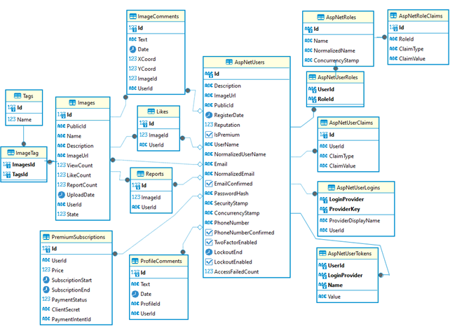

Database scheme

 

Main page (user not logged in)

When you click on the "Gallery" button in the navigation bar, the gallery page with filtering and sorting bar opens.

 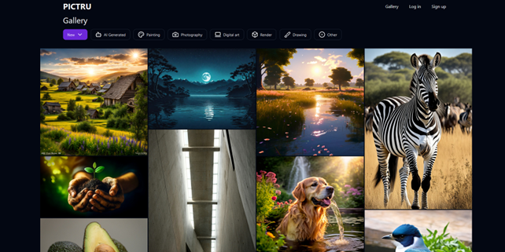

Gallery page

Clicking on an image opens the image preview page, showing an enlarged image, comments section, image description, view count, and like count. Comments with a linked image location have a tag indicating this. Hovering over such a comment highlights the linked image location. A logged-out user cannot leave comments, increase the like count, or report incorrectly tagged images.

 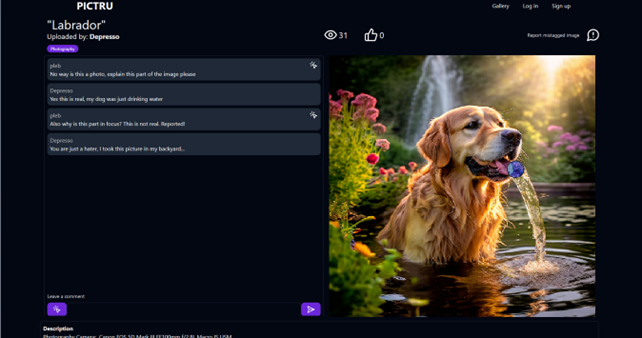

Image preview page

Clicking on an image enlarges it to full screen.

 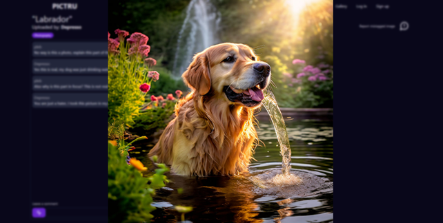

Enlarged image

Clicking on the name of the user who uploaded the image or left a comment opens the profile page. The profile page displays the user's description, comments section, and uploaded images. A logged-out user cannot leave a profile comment.

 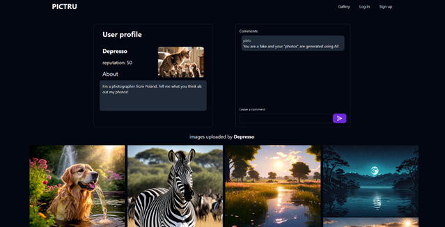

User profile view page

Clicking on the "Sign up" button in the navigation bar opens the registration page.

 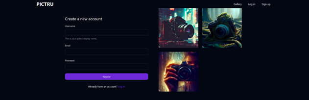

Registration page

After registering or clicking on the "Log in" button in the navigation bar, the login page opens.

 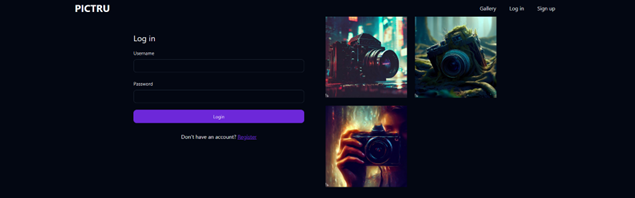

Login page

The navigation bar of a logged-in user is updated with buttons for "Suspended images" to view blocked images, "Upload" to upload a new image, "My account" to view the profile, "Become premium" to become a "Premium" user, and "Logout" to log out.

 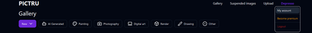

User navigation bar

Clicking the "Upload" button opens the image upload page.

 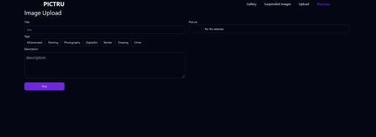

Image upload page

In the image upload page, selecting tags automatically updates the "Description" text field indicating what description the user should add. Clicking "Post" opens the image preview page.

 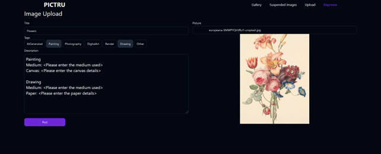

Image upload page with data

In the image preview page, the user can write a comment, edit or delete it. Edit and delete the image if the user is the image author. Like or report incorrectly tagged images.

 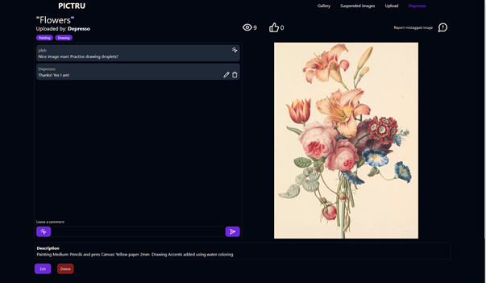

Image preview page

When editing a comment, the comment form elements are changed. The button that was used to link the image location to the comment becomes the button that cancels the comment editing. The text and the comment save button indicating that the comment is being edited are also updated.

 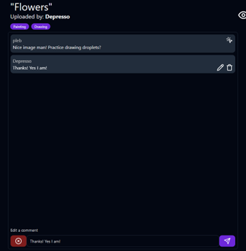

Comment editing

When trying to delete an image, a "Dialog" type element with action confirmation is called.

 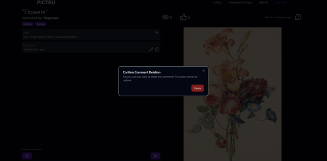

Image deletion confirmation message

Clicking the "Edit" button opens the image editing page. The editing page is similar to the image upload page, but the difference is that you cannot upload a new image.

 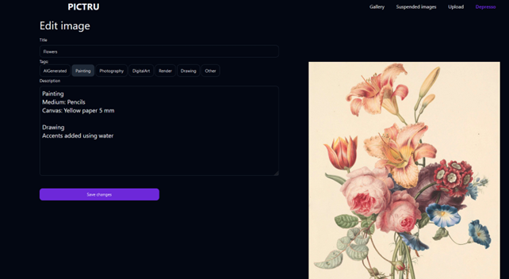

Image information editing page

If the user is on their profile view page, they will see a button to edit profile information and delete comments left by other users.

 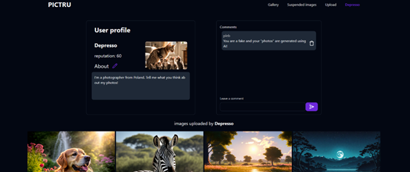

User profile page

Clicking the pencil button opens the profile editing page, where the user can change their description and picture.

 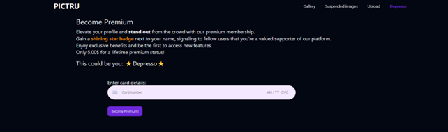

User profile editing form

Clicking on the user's name in the navigation bar and opening the "Become Premium" page, the user can enter credit card details and obtain "Premium" status.

 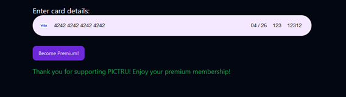

“Premium” status purchase page

After entering the correct card details and clicking the "Become Premium!" button, a message about successful payment and obtaining "Premium" status is displayed.

 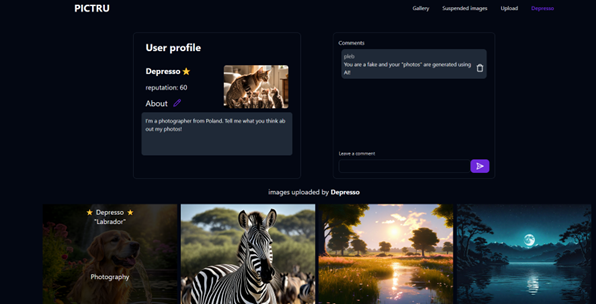

Successful payment message

Users with "Premium" status have stars next to their names when viewing their profile or uploaded image.

 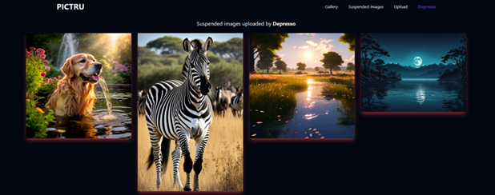

“Premium” user profile view page

For demonstration purposes, the status of images uploaded by the user is changed to "suspended". The user can view the images by clicking the "Suspended images" button in the navigation bar.

 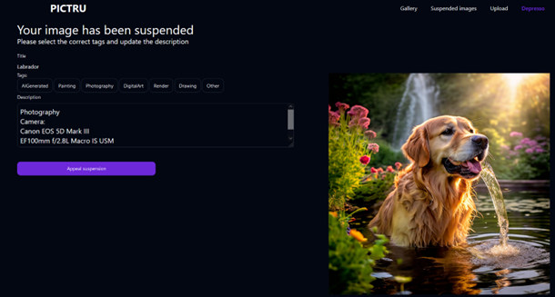

User blocked images view page

Clicking on a blocked image opens the blocked image view page. In the view page, the user can change the image tags and update the description. Clicking the "Appeal suspension" button will change the image status to "Appealed".

 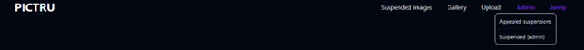

Blocked image view page

The navigation bar of a user with a moderator role is updated by adding an "Admin" section, through which you can access the pages for viewing appealed images and all blocked images.

 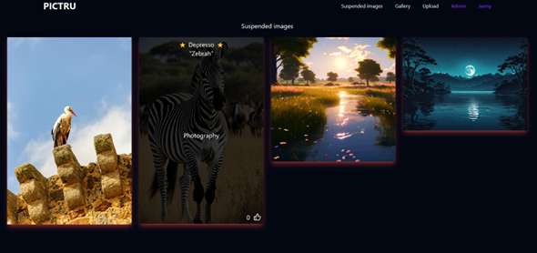

Moderator's navigation bar

In the all blocked images page, all blocked images of users are visible.

 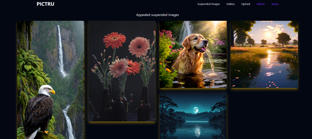

All blocked images view page

For demonstration purposes, the status of "suspended" images is changed to "appealed". In the appealed images view page, all blocked images that were appealed are visible.

 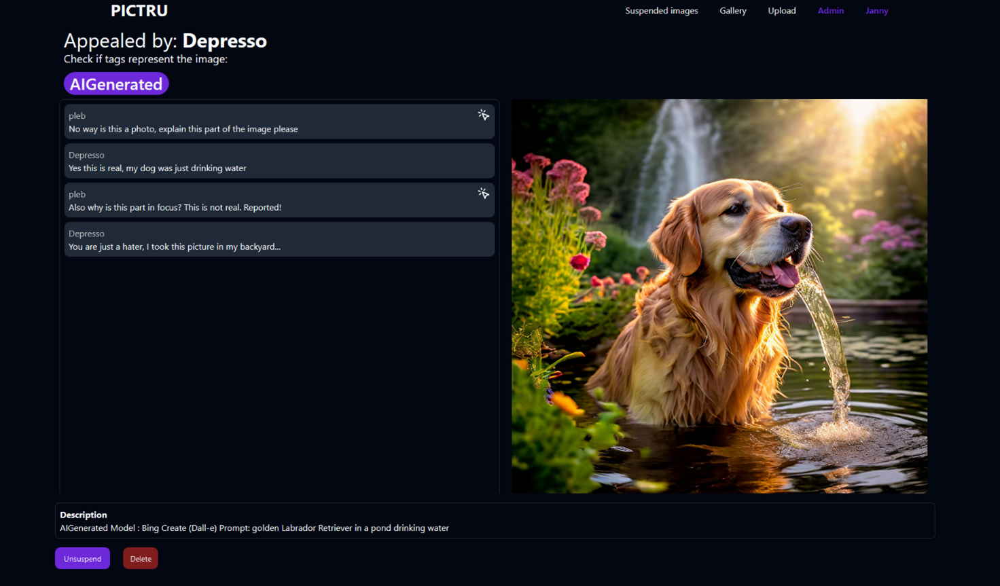

Appealed images view page

Clicking on an appealed image opens the appealed image view page. In this page, the updated image information along with comments is visible. The moderator can decide whether to unblock or delete the image.

 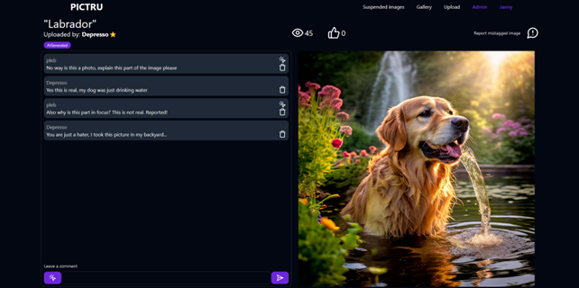

Appealed image view page

After unblocking an image, the moderator is taken to the image view page. The moderator can delete comments left by other users that are no longer relevant after updating the image information.

 

Image view page (moderator)

# Testing

A test plan is needed to define the order in which the tests are to be performed and the testing techniques and tools to be used. The following plan was followed during the development of the system:

1. Use the static code analysis tools ESLint and Prettier throughout the development. These tools help to avoid syntax errors, report unused variables and help to keep the structure of the code in order [10] [11].
2. Implementations of server-side methods write automated tests using xUnit together with Moq frameworks. Ensuring that changes made during system development do not break previously implemented functions.
3. Using the ThunderClient plugin in VSCode to create integration tests that will automatically check whether the server side is correctly processing the requests sent by the client.
4. At the end of the project development, manually perform full client-side testing to ensure that all use cases are implemented.

Testing criteria

1. Functional and non-functional requirements - Ensure that all functions of the system function as described in the Requirements Specification.
2. Code Quality - Use tools such as ESLint and Prettier to avoid redundant lines of code, code order and maintenance of best practice standards.
3. Cover the main parts of the system that are required for its operation with integration and unit tests.
4. Manual testing - To make sure that all use cases are realised and to ensure that users can use the system.
5. Compliance - Verify that the system meets all functional and non-functional requirements specified in the design specification to ensure the overall quality of the system.

Unit tests are written using xUnit and Moq. "xUnit is a popular .NET testing framework. "Moq is a library that can be used to create virtual objects and isolate the code under test. Using these technologies, 43 unit tests have been written

 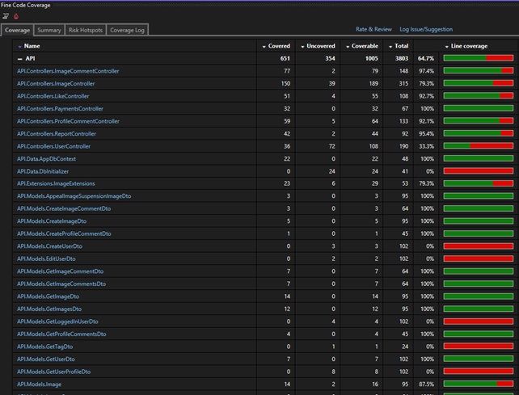

"Fine Code Coverage Unit Test Code Coverage Report"

 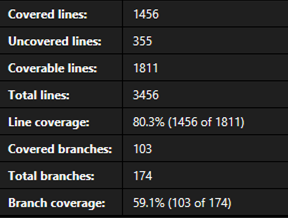

Fine Code Coverage Code Coverage Unit Tests Extended Report"

